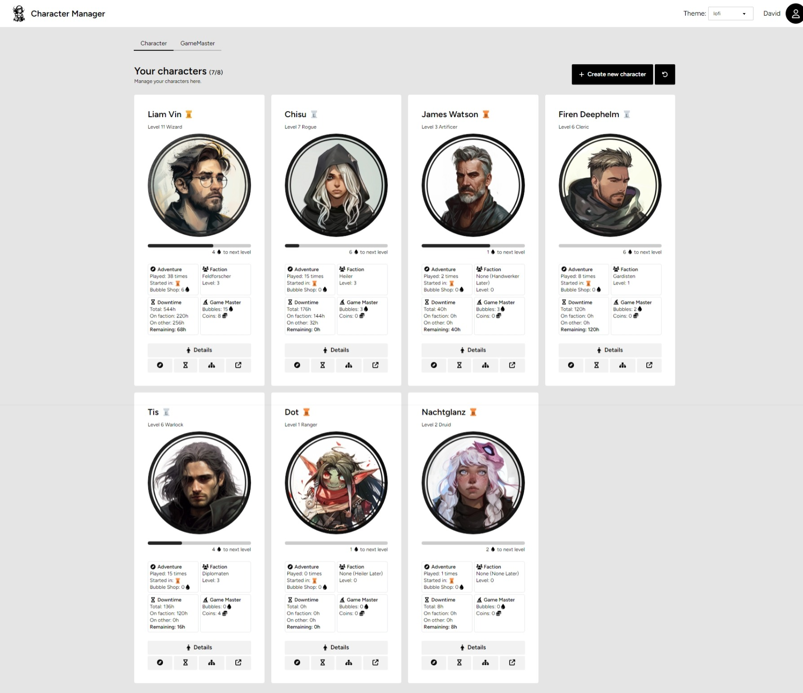

# Character Manager

## Magiergilde Game and Character Manager

Welcome to the official repository for the Magiergilde Game and Character Manager! This program is a comprehensive tool designed for the Magiergilde community to organize, track, and manage their various games and the characters they play.

## Features

- **Game Library**: Keep all your Magiergilde games in one place. Add new games, edit existing ones, and organize them as you see fit.
- **Character Profiles**: Create detailed profiles for each of your characters, including stats, backstory, equipment, and more.
- **Session Logs**: Document your game sessions with notes, outcomes, and character developments.
- **Customizable Interface**: Tailor the program's interface to match the theme of your current game or character.

## License

This project is open-sourced software licensed under the [MIT license](https://opensource.org/licenses/MIT).
